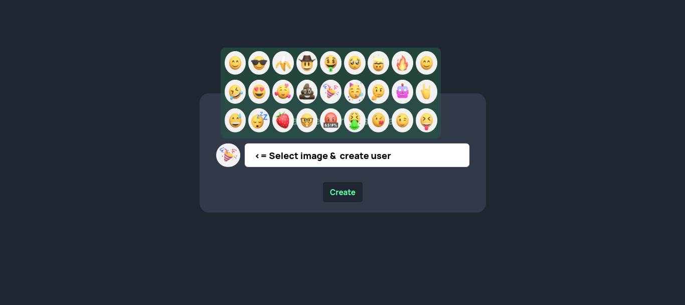
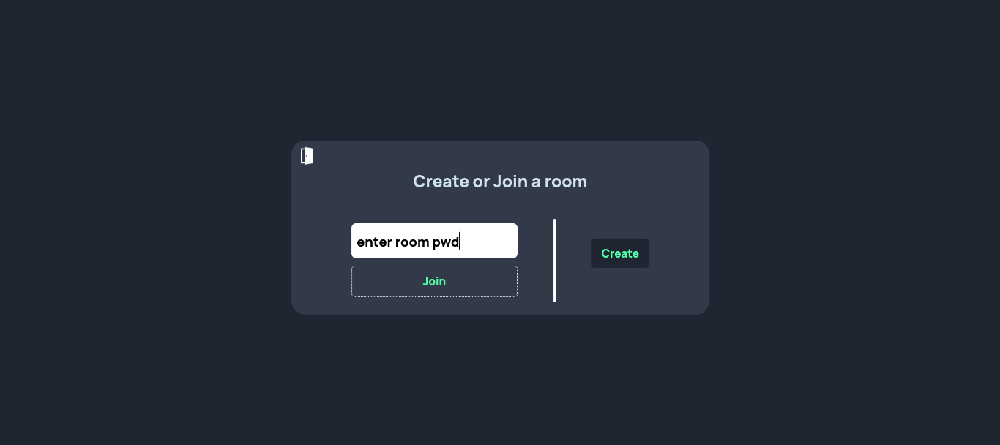
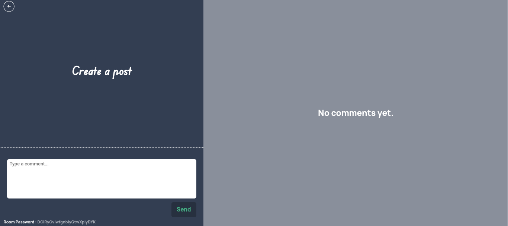
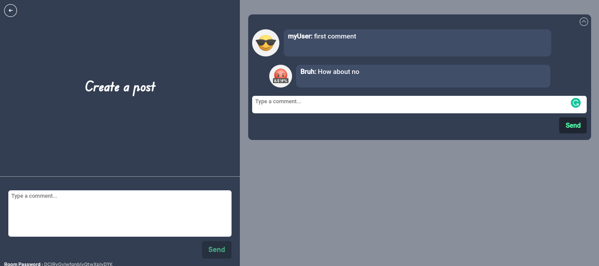

# Conversate

A Secure post/commenting App. You start by creating a user and an emoji as a profile picture (no login). Then you can either join or create a post room which will generate a password for you to give to people who'd you think are allowed to join your room and start commenting.

The app doesn't require a login, you just select a user name and an image (optional) and then you're all set. However, once you do that your user will be stored in your device as long as you don't clear your data. though you can log out from the room join/create dashboard.

## Screenshots

## App

[App Link](https://conversateapp.netlify.app/)

## Built With

- ReactJs, plain CSS
- Rails API for backend (You can contact me if you're interested about the backend)
- Ngrok

## Getting Started

It's a simple react project you can get away with npm i and then npm start

## Authors

👤 **Mohamed Amine**

- GitHub: [@AmineHLub](https://github.com/AmineHLub)
- Twitter: [@Amino47612441](https://twitter.com/Amino47612441)
- LinkedIn: [LinkedIn](https://www.linkedin.com/in/mohamed-amine-hajltaief-b18863163/)

## 🤝 Contributing

Contributions, issues, and feature requests are welcome!

Feel free to check the [issues page](../../issues/).

## Show your support

Give a ⭐️ if you like this project!

## Acknowledgments

- Parts of the design are inspired from frontendmoentor.io
- Emoji pack from [Figma](https://www.figma.com/file/M3DEYkGY4YgMI7J4wHVpOh/3MOJI---3D-Illustrations-Pack-(Community)-(Community)?node-id=14%3A23)

## 📝 License

This project is [MIT](./MIT.md) licensed.
